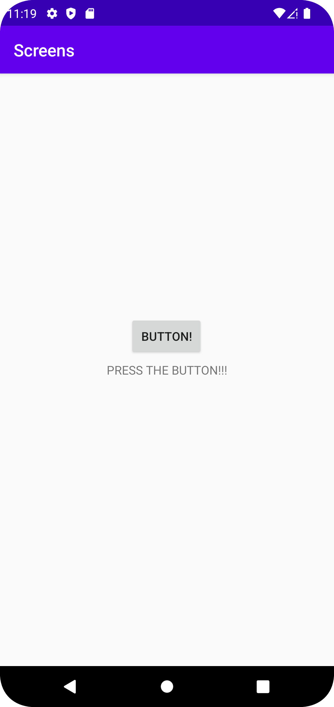
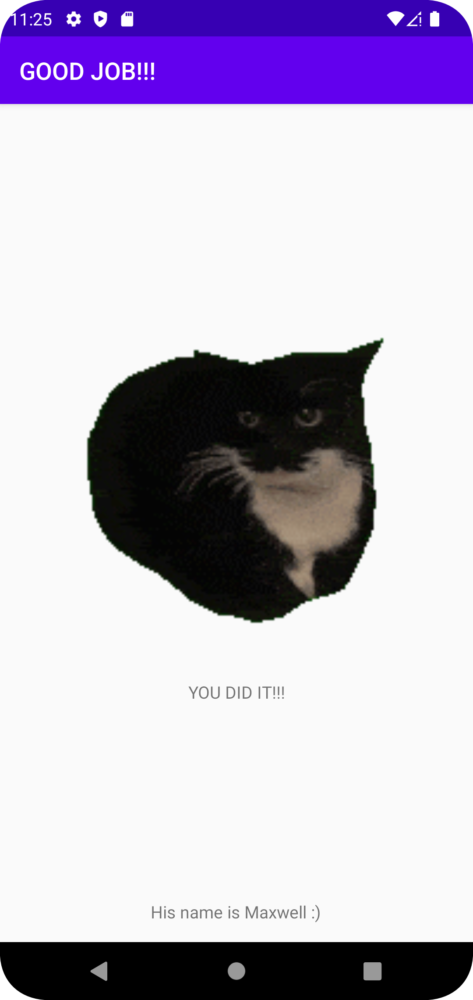

# Rapport

**Skriv din rapport här!**

Lade till MainActivity2

Skapade en knapp i activity_main.xml
```
    <Button
        android:id="@+id/button"
        android:layout_width="wrap_content"
        android:layout_height="wrap_content"
        android:text="Button!"
        app:layout_constraintBottom_toBottomOf="parent"
        app:layout_constraintEnd_toEndOf="parent"
        app:layout_constraintHorizontal_bias="0.498"
        app:layout_constraintStart_toStartOf="parent"
        app:layout_constraintTop_toTopOf="parent"
        app:layout_constraintVertical_bias="0.439" />
```

Skapade ett intent i MainActivity som öppnar MainActivity2 och sedan gjort så att när knappen trycks startar intentet,
dvs MainActivity2 öppnas.

Lade också till extradata i intentet.

```
final Intent intent = new Intent(MainActivity.this, MainActivity2.class);
        intent.putExtra("name", "His name is Maxwell :)");

        Button btn = (Button)findViewById(R.id.button);
        btn.setOnClickListener(new View.OnClickListener() {
            @Override
            public void onClick(View v) {
                startActivity(intent);
            }

        });
```

Redigerade activity_main2 med widgets. Gjorde sedan så att ett av widgets:en visar extradatan som intentet skickade 
(Detta gjordes i MainActivity2).
```
 Bundle extras = getIntent().getExtras();

        if(extras != null) {

            textView.setText(extras.getString("name"));

        }
```

(Hur jag fick gif:en till att animeras är inte relevant till uppgiften så det tas inte med i rapporten.)



